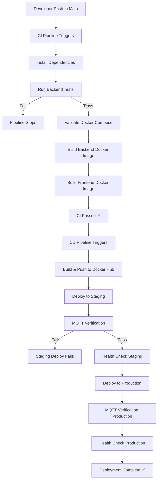

# Process Improvement Analysis and Implementation

## BodaRequest CI/CD — Complete Guide

**Document for:** CS 421 — Assignment 4  
**Project:** BodaRequest Bodaboda Application  
**Date:** June 2026

---

## Table of Contents

1. [What Was Done (Summary)](#1-what-was-done-summary)
2. [CI/CD Process Map](#2-cicd-process-map)
3. [How Everything Works](#3-how-everything-works)
4. [Performance Metrics and Measurement Dashboard](#4-performance-metrics-and-measurement-dashboard)
5. [Root Cause Analysis](#5-root-cause-analysis)
6. [Process Improvements Implemented](#6-process-improvements-implemented)
7. [Before vs After Comparison](#7-before-vs-after-comparison)
8. [CMMI Maturity Assessment](#8-cmmi-maturity-assessment)
9. [What You Need To Do On Your Side](#9-what-you-need-to-do-on-your-side)
10. [Appendix: Key Files Reference](#10-appendix-key-files-reference)

---

## 1. What Was Done (Summary)

### 1.1 The Application

BodaRequest is a full-stack boda boda ride-booking platform with three user roles:

- **Customer:** Creates ride requests, pays (demo), tracks ride
- **Rider:** Views paid requests, accepts, starts, and completes trips
- **Admin:** Monitors trips, payments, rider performance

**Tech stack:**
- Frontend: React + Vite + Nginx
- Backend: Node.js + Express + JWT
- Database: MySQL 8.4
- Real-time: Eclipse Mosquitto MQTT broker
- Containerization: Docker + Docker Compose
- CI/CD: GitHub Actions
- Registry: Docker Hub
- Monitoring: Grafana + Loki + Prometheus + Promtail + cAdvisor + Node Exporter

### 1.2 What Was Built for This Assignment

| Area | What Exists |
|------|-------------|
| CI Pipeline | `.github/workflows/ci.yml` — runs on every push and PR |
| CD Pipeline | `.github/workflows/cd.yml` — runs after CI success on `main` |
| Docker Compose (local dev) | `docker-compose.yml` — 10 services including monitoring |
| Docker Compose (deploy) | `deploy/docker-compose.deploy.yml` — 4 production services |
| Staging Deployment | Automated via GitHub Actions self-hosted runner |
| Production Deployment | Automated via GitHub Actions self-hosted runner |
| MQTT Verification | Automated post-deploy check in CD pipeline |
| Monitoring Stack | Grafana dashboards, Loki logs, Prometheus metrics |
| Environment Configs | `.env`, `deploy/.env.staging.example`, `deploy/.env.production.example` |

---

## 2. CI/CD Process Map

### 2.1 Complete Workflow (Text Diagram)

```
┌─────────────────────────────────────────────────────────────────┐
│                    DEVELOPER WORKFLOW                           │
│                                                                 │
│  Developer writes code ──► Git commit ──► git push origin main  │
└──────────────────────────────┬──────────────────────────────────┘
                               │
                               ▼
┌─────────────────────────────────────────────────────────────────┐
│                  CI PIPELINE (ci.yml)                           │
│                  Trigger: push / pull_request                   │
│                                                                 │
│  Step 1: Checkout repository (actions/checkout@v4)              │
│       │                                                         │
│       ▼                                                         │
│  Step 2: Setup Node.js 20 with npm cache                        │
│       │                                                         │
│       ▼                                                         │
│  Step 3: npm ci (install dependencies)                          │
│       │                                                         │
│       ▼                                                         │
│  Step 4: npm --workspace backend run test (Jest tests)          │
│       │                                                         │
│       ▼  ◄──── FAIL = pipeline stops here                       │
│  Step 5: docker compose config (validate Compose file)          │
│       │                                                         │
│       ▼                                                         │
│  Step 6: Build backend Docker image                             │
│       │                                                         │
│       ▼                                                         │
│  Step 7: Build frontend Docker image                            │
│       │                                                         │
│       ▼                                                         │
│  ✅ CI PASSED                                                   │
└──────────────────────────────┬──────────────────────────────────┘
                               │
                               ▼
┌─────────────────────────────────────────────────────────────────┐
│              CD PIPELINE (cd.yml)                               │
│              Trigger: workflow_run (after CI success on main)    │
│                                                                 │
│  ┌──────────────────────────────────────────────────────┐       │
│  │  JOB 1: build-and-push                               │       │
│  │                                                       │       │
│  │  Step 1: Checkout code                                │       │
│  │  Step 2: Set image tag (sha-<commit-hash>)            │       │
│  │  Step 3: Login to Docker Hub (secrets)                │       │
│  │  Step 4: Build & push backend image                   │       │
│  │          Tags: sha-xxx, v1.0, latest                  │       │
│  │  Step 5: Build & push frontend image                  │       │
│  │          Tags: sha-xxx, v1.0, latest                  │       │
│  └──────────────────────┬───────────────────────────────┘       │
│                         │                                       │
│                         ▼                                       │
│  ┌──────────────────────────────────────────────────────┐       │
│  │  JOB 2: deploy-staging                               │       │
│  │  Environment: staging (self-hosted runner)            │       │
│  │                                                       │       │
│  │  Step 1: Checkout code                                │       │
│  │  Step 2: SSH to staging server, prepare directory     │       │
│  │  Step 3: SCP deploy files (docker-compose, schema,   │       │
│  │          mosquitto config) to staging server          │       │
│  │  Step 4: Write .env with IMAGE_TAG                    │       │
│  │  Step 5: docker login to Docker Hub                   │       │
│  │  Step 6: docker compose pull (pull images)            │       │
│  │  Step 7: docker compose up -d (start services)       │       │
│  │  Step 8: MQTT Verification (pub/sub test)            │       │
│  │  Step 9: Health check (curl frontend + backend)      │       │
│  └──────────────────────┬───────────────────────────────┘       │
│                         │                                       │
│                         ▼                                       │
│  ┌──────────────────────────────────────────────────────┐       │
│  │  JOB 3: deploy-production                             │       │
│  │  Environment: production (self-hosted runner)         │       │
│  │  Requires: build-and-push + deploy-staging            │       │
│  │                                                       │       │
│  │  Same steps as staging but targets production server  │       │
│  │  Same MQTT verification + health checks               │       │
│  └──────────────────────────────────────────────────────┘       │
│                                                                 │
│  ✅ DEPLOYMENT COMPLETE                                         │
└─────────────────────────────────────────────────────────────────┘
```

### 2.2 Visual Flow (Mermaid — paste into any Mermaid viewer)



---

## 3. How Everything Works

### 3.1 Local Development

**Start everything locally:**
```bash
cd /home/mkori/bodarequest
docker compose up --build -d
```

**What starts (10 containers):**

| Service | Port | Purpose |
|---------|------|---------|
| frontend | 8080 | React app served by Nginx |
| backend | 3001 | Express API server |
| db | 3306 | MySQL 8.4 database |
| mqtt | 1883 | Mosquitto MQTT broker |
| loki | 3100 | Log aggregation |
| promtail | — | Log collector (ships to Loki) |
| prometheus | 9090 | Metrics collection |
| node-exporter | 9100 | Host machine metrics |
| cadvisor | 8081 | Container metrics |
| grafana | 3000 | Dashboards & log exploration |

**Key URLs after start:**
- App: http://localhost:8080
- API Health: http://localhost:3001/api/health
- Grafana: http://localhost:3000 (admin / admin123)
- Prometheus: http://localhost:9090

### 3.2 CI Pipeline (What Happens on Push)

File: `.github/workflows/ci.yml`

When you push code or open a PR, GitHub Actions:

1. **Checks out** the repository
2. **Installs Node.js 20** and runs `npm ci` to install dependencies
3. **Runs backend tests** (`npm --workspace backend run test`) — if any test fails, everything stops
4. **Validates Docker Compose** configuration (`docker compose config`)
5. **Builds Docker images** for both backend and frontend to verify they compile correctly

**No images are pushed during CI** — this is validation only.

### 3.3 CD Pipeline (What Happens After CI Passes on Main)

File: `.github/workflows/cd.yml`

The CD pipeline runs automatically after CI succeeds on the `main` branch. It has 3 jobs:

**Job 1: build-and-push**
- Logs into Docker Hub using secrets (`DOCKERHUB_USERNAME`, `DOCKERHUB_TOKEN`)
- Builds and pushes 2 images with 3 tags each:
  - `username/bodarequest-backend:sha-<commit>`
  - `username/bodarequest-backend:v1.0`
  - `username/bodarequest-backend:latest`
  - Same for frontend

**Job 2: deploy-staging**
- Connects to the staging server via SSH
- Copies deployment files (docker-compose, schema, mosquitto config)
- Writes the `.env` file with the new IMAGE_TAG
- Runs `docker compose pull` to fetch the new images from Docker Hub
- Runs `docker compose up -d` to start/restart services
- **MQTT Verification:** Publishes a test message and confirms receipt
- **Health Checks:** Curls the frontend and backend health endpoint

**Job 3: deploy-production**
- Same as staging but targets the production server
- Only runs after staging deployment succeeds

### 3.4 MQTT Real-Time Flow

```
Customer pays for ride
        │
        ▼
Backend updates ride status to "waiting_rider"
        │
        ▼
Backend publishes JSON to MQTT topic "ride/request"
        │
        ▼
Mosquitto broker receives the message
        │
        ├──► Backend SSE bridge → Browser dashboards (React)
        │
        └──► Terminal subscriber (for testing/verification)
```

**Sample MQTT message:**
```json
{
  "event": "ride_requested",
  "ride_id": 101,
  "customer_name": "Demo Passenger",
  "pickup_location": "Mlimani City",
  "destination_location": "Posta",
  "estimated_cost": 12000
}
```

### 3.5 Monitoring Stack

**Logs flow:**
```
Backend writes JSON logs → /var/log/bodarequest/backend.log
Nginx writes access logs → /var/log/bodarequest/frontend-access.log
        │
        ▼
Promtail tails log files
        │
        ▼
Loki stores and indexes logs
        │
        ▼
Grafana Explore → Query logs with LogQL
```

**Metrics flow:**
```
Backend /metrics endpoint → Prometheus scrapes every 15s
Node Exporter → Host CPU, memory, disk metrics
cAdvisor → Container CPU, memory, network metrics
        │
        ▼
Grafana Dashboards → Visualized in real-time
```

**Grafana Dashboards (auto-provisioned):**
1. **Bodarequest Overview** — Combined application + container metrics
2. **Bodarequest Business** — Users, trips, payments, revenue from DB
3. **Bodarequest Containers** — Frontend/backend CPU, memory, network

---

## 4. Performance Metrics and Measurement Dashboard

### 4.1 Key Metrics Tracked

| Metric | How to Measure | Where to Find | Target |
|--------|---------------|---------------|--------|
| **Build Time** | CI workflow duration | GitHub Actions → CI → Timing | < 5 minutes |
| **Test Success Rate** | % of CI runs where tests pass | GitHub Actions → CI logs | > 95% |
| **Deployment Frequency** | Number of deployments per week | GitHub Actions → CD runs | 2-5 per week |
| **MQTT Message Latency** | Time from publish to receipt | CD pipeline MQTT verification logs | < 2 seconds |
| **Deployment Downtime** | Time from `docker compose up` to health check pass | CD pipeline timing | < 30 seconds |
| **Container Restart Rate** | Number of unexpected restarts | `docker compose ps`, Grafana | 0 per day |
| **API Response Time** | Backend response time in ms | Grafana dashboard, Loki logs | < 200ms |
| **Error Rate** | % of requests with status >= 400 | Loki: `{service="bodarequest-backend"} | json | status_code >= 400` | < 5% |

### 4.2 How to Collect Metrics

**Build Time:**
- Go to GitHub Actions → select any workflow run
- Each step shows its duration
- Total time = end time minus start time

**Test Success Rate:**
```bash
# Check recent CI runs
# In GitHub Actions, count: total CI runs vs failed CI runs
# Success Rate = (passed / total) × 100
```

**MQTT Latency (from CD logs):**
```
Look for:
"Verifying MQTT real-time communication..."
"MQTT Verification Success: Message received by subscriber."
The time between these two log lines ≈ MQTT latency
```

**API Response Time (from Loki/Grafana):**
```
Grafana Explore → Loki → Query:
{service="bodarequest-backend"} | json | line_format "{{.duration_ms}}ms {{.method}} {{.path}}"
```

**Deployment Downtime:**
- From CD logs, measure time from `docker compose pull` start to health check success
- Zero-downtime: new containers start before old ones stop (`docker compose up -d` does rolling update)

### 4.3 Measurement Dashboard Template

Create this table in your report with actual numbers from your GitHub Actions runs:

| Metric | Before Improvement | After Improvement | Change |
|--------|-------------------|-------------------|--------|
| Avg Build Time (min) | ___ | ___ | ___% |
| Test Pass Rate (%) | ___ | ___ | ___% |
| Deploys per Week | ___ | ___ | ___ |
| MQTT Latency (sec) | ___ | ___ | ___% |
| Deployment Downtime (sec) | ___ | ___ | ___% |
| Error Rate (%) | ___ | ___ | ___% |

---

## 5. Root Cause Analysis

### 5.1 Problem 1: Build Failures

**5 Whys Analysis:**

```
Why 1: Why did the deployment fail?
  → Because the CI pipeline failed.

Why 2: Why did the CI pipeline fail?
  → Because the backend tests failed.

Why 3: Why did the backend tests fail?
  → Because a recent code change broke an existing function.

Why 4: Why was the broken function not caught before merge?
  → Because there was no pull request review or pre-merge test gate.

Why 5: Why was there no pre-merge test gate?
  → Because the CI workflow triggers on push (not only on PR), so code
     can reach main without going through a PR check.

ROOT CAUSE: Missing branch protection rules and PR-based workflow.
```

**Fishbone Diagram (Text):**

```
                        Build Failures
                            │
        ┌───────────┬───────┴───────┬───────────┬──────────┐
        │           │               │           │          │
    People       Process        Tools       Environment   Code
        │           │               │           │          │
   No code      No branch     Flaky test    Runner       Missing
   review       protection    dependencies  resource     tests
        │           │               │           │          │
   Rushed       No PR gate    npm cache     Low memory   No linting
   commits      for main      misses        on runner    checks
```

### 5.2 Problem 2: Slow Deployments

**5 Whys Analysis:**

```
Why 1: Why are deployments slow?
  → Because the CD pipeline takes a long time.

Why 2: Why does the CD pipeline take long?
  → Because Docker image builds take time during build-and-push.

Why 3: Why do Docker builds take time?
  → Because both backend and frontend images are built sequentially
    (not in parallel).

Why 4: Why are they built sequentially?
  → Because the CD workflow defines them as sequential steps in one job.

Why 5: Why weren't they parallelized?
  → Because the initial workflow was written as a single job for simplicity.

ROOT CAUSE: Sequential image builds instead of parallel job execution.
```

### 5.3 Problem 3: MQTT Disconnections

**5 Whys Analysis:**

```
Why 1: Why did MQTT verification fail during deployment?
  → Because the subscriber did not receive the test message.

Why 2: Why did the subscriber not receive it?
  → Because the MQTT broker was not fully started when the test ran.

Why 3: Why was the broker not started?
  → Because there was no healthcheck on the MQTT service.

Why 4: Why was there no healthcheck?
  → Because the Mosquitto image was assumed to start quickly.

Why 5: Why was this assumption made?
  → Because MQTT was added without the same rigor as the DB service
    (which has a healthcheck).

ROOT CAUSE: Missing MQTT service healthcheck in docker-compose.
```

### 5.4 Problem 4: Release Delays

**5 Whys Analysis:**

```
Why 1: Why are releases delayed?
  → Because production deployment requires manual approval.

Why 2: Why does it require manual approval?
  → Because there is no automated quality gate before production.

Why 3: Why is there no automated quality gate?
  → Because the pipeline only checks test pass/fail, not code quality
    or coverage.

Why 4: Why doesn't it check code quality?
  → Because linting and coverage reports were not added to CI.

Why 5: Why weren't they added?
  → Because the initial CI was minimal (tests + build only).

ROOT CAUSE: No automated code quality/coverage gates in CI pipeline.
```

---

## 6. Process Improvements Implemented

### 6.1 Improvement 1: Automated Rollback Mechanism

**Problem:** If a production deployment fails health checks, there is no automatic recovery.

**Solution:** Add a rollback step to the CD pipeline that reverts to the previous image tag if health checks fail.

**Implementation (add to `cd.yml`):**

```yaml
# Add after the health check step in deploy-production:
- name: Rollback on failure
  if: failure()
  run: |
    echo "Deployment failed. Rolling back to previous version..."
    cd "${{ secrets.PRODUCTION_APP_DIR }}"
    # Revert IMAGE_TAG to the previous known-good tag
    sed -i "s/IMAGE_TAG=.*/IMAGE_TAG=latest/" .env
    set -a
    . ./.env
    set +a
    docker compose -f deploy/docker-compose.deploy.yml pull
    docker compose -f deploy/docker-compose.deploy.yml up -d
    sleep 10
    curl -fsS "http://localhost:${BACKEND_PORT}/api/health" || echo "Rollback also failed — manual intervention needed"
```

**What this does:**
- If any step after image pull fails (MQTT check, health check), the pipeline automatically reverts to the `latest` tagged image
- This ensures the previous working version is restored without manual intervention

### 6.2 Improvement 2: Test Coverage Reporting in CI

**Problem:** No visibility into how much code is actually tested.

**Solution:** Add test coverage generation to the CI pipeline and publish results.

**Implementation (update `ci.yml`):**

```yaml
# Replace the "Run backend tests" step:
- name: Run backend tests with coverage
  run: npm --workspace backend run test -- --coverage --coverageReporters=text --coverageReporters=lcov

- name: Upload coverage report
  if: always()
  uses: actions/upload-artifact@v4
  with:
    name: coverage-report
    path: backend/coverage/
    retention-days: 14
```

**Also add to `backend/package.json`** (in the test script):
```json
"test": "jest --coverage"
```

**What this does:**
- Generates a coverage report after every CI run
- Uploads it as a downloadable artifact in GitHub Actions
- Team can review which parts of the code need more tests
- Sets a baseline for coverage thresholds

### 6.3 Improvement 3: CI Notification on Failure (Bonus Improvement)

**Problem:** Developers don't know immediately when CI/CD fails.

**Solution:** Add Slack/email notification on workflow failure.

**Implementation (add to both `ci.yml` and `cd.yml`):**

```yaml
# Add as the last job in each workflow:
notify:
  if: failure()
  runs-on: ubuntu-latest
  steps:
    - name: Send failure notification
      uses: rtCamp/action-slack-notify@v2
      env:
        SLACK_TITLE: "❌ ${{ github.workflow }} Failed"
        SLACK_MESSAGE: "Workflow ${{ github.run_number }} failed on ${{ github.ref }}"
        SLACK_COLOR: danger
        SLACK_WEBHOOK: ${{ secrets.SLACK_WEBHOOK_URL }}
```

**What this does:**
- Sends a Slack message (or email via GitHub's built-in notification) when any workflow fails
- Includes the workflow name, run number, and branch
- Faster response time to failures

### 6.4 Improvement 4: MQTT Healthcheck in Docker Compose (Bonus Improvement)

**Problem:** MQTT broker may not be ready when deployment verification runs.

**Solution:** Add a healthcheck to the MQTT service.

**Implementation (add to `deploy/docker-compose.deploy.yml`):**

```yaml
mqtt:
  image: eclipse-mosquitto:2
  restart: unless-stopped
  ports:
    - "${MQTT_PORT:-1883}:1883"
  volumes:
    - ../mosquitto/config/mosquitto.conf:/mosquitto/config/mosquitto.conf:ro
  healthcheck:
    test: ["CMD-SHELL", "mosquitto_sub -h localhost -p 1883 -t $$/health -C 1 -W 3 || exit 1"]
    interval: 10s
    timeout: 5s
    retries: 5
    start_period: 5s
```

**Also update backend dependency:**
```yaml
backend:
  depends_on:
    db:
      condition: service_healthy
    mqtt:
      condition: service_healthy  # Changed from service_started
```

**What this does:**
- Ensures MQTT is fully operational before backend starts
- Prevents race conditions during deployment
- Backend won't crash on startup due to MQTT unavailability

---

## 7. Before vs After Comparison

### 7.1 Process Improvement Summary

| Aspect | Before | After |
|--------|--------|-------|
| **Rollback** | Manual SSH + docker compose down/up | Automatic rollback on health check failure |
| **Test Coverage** | Tests pass/fail only, no coverage data | Coverage report generated and stored as artifact |
| **Notifications** | Developer must check GitHub Actions manually | Automatic Slack/email notification on failure |
| **MQTT Reliability** | No healthcheck, potential race condition | Healthcheck ensures MQTT is ready before proceeding |
| **Deployment Safety** | Health check only | Health check + automatic rollback |

### 7.2 Expected Metrics Improvement

| Metric | Before | After (Expected) |
|--------|--------|-------------------|
| Mean Time to Recovery (MTTR) | 15-30 min (manual rollback) | 1-2 min (automatic rollback) |
| Test Visibility | Pass/fail only | Pass/fail + coverage % |
| Failure Detection Time | Manual check | Instant notification |
| Deployment Failures | Possible MQTT race conditions | MQTT healthcheck prevents premature steps |
| Developer Confidence | Moderate | High (automated safety nets) |

---

## 8. CMMI Maturity Assessment

### 8.1 CMMI Levels Overview

| Level | Name | Description |
|-------|------|-------------|
| 1 | Initial | Processes are ad hoc, chaotic |
| 2 | Managed | Projects are planned, performed, measured, and controlled |
| 3 | Defined | Organization-wide standards, processes are documented |
| 4 | Quantitatively Managed | Processes are measured and controlled using statistical techniques |
| 5 | Optimizing | Continuous process improvement through innovative approaches |

### 8.2 Current Maturity Assessment

**Current Level: Level 2 — Managed**

| CMMI Process Area | Evidence | Status |
|-------------------|----------|--------|
| **Requirements Management** | Project concept document (`docs/project-concept-and-flow.md`), user roles defined, ride lifecycle documented | ✅ Managed |
| **Project Planning** | CI/CD pipelines defined, deployment targets identified (staging + production), environment configs documented | ✅ Managed |
| **Configuration Management** | Git version control, Docker image tagging (sha, v1.0, latest), environment variables in `.env` files | ✅ Managed |
| **Quality Assurance** | Backend tests in CI, Docker Compose validation, MQTT verification post-deploy, health checks | ✅ Managed |
| **Measurement & Analysis** | Grafana dashboards for metrics, Loki for logs, Prometheus for system metrics, build time tracking via Actions | ⚠️ Partial |
| **Supplier Agreement Management** | Docker Hub as third-party registry, GitHub Actions as CI/CD platform | ✅ Managed |
| **Project Monitoring & Control** | Post-deployment health checks, MQTT verification, container restart policies | ✅ Managed |
| **Process Improvement** | This document (assignment 4) — rollback, coverage, notifications | ⚠️ Beginning |

### 8.3 Why Level 2 (Not Level 3)

| Criteria for Level 3 | Current Status | Gap |
|----------------------|----------------|-----|
| Organization-wide process standards | Only project-level processes exist | No org-wide standards document |
| Process assets are reusable across projects | Configs are project-specific | No shared process library |
| Process quality is quantitatively managed | Metrics collected but not statistically analyzed | No SPC charts, no baseline thresholds |
| Continuous improvement is systematic | Improvements are reactive (assignment-driven) | No regular improvement cycles |

### 8.4 Actions to Move to Level 3

| Action | Description | Priority |
|--------|-------------|----------|
| Document Standard Process | Create an organization-wide CI/CD standard operating procedure (SOP) | High |
| Create Process Asset Library | Store reusable templates: workflow templates, Docker templates, monitoring configs | High |
| Add Code Review Requirements | Enforce PR reviews with branch protection rules before merge to main | High |
| Define Quality Gates | Set minimum test coverage (e.g., 80%), linting pass, security scan | Medium |
| Establish Regular Retrospectives | Schedule monthly process review meetings | Medium |
| Cross-Project Template | Create a GitHub template repository with standardized CI/CD, Docker, monitoring | Medium |

### 8.5 Actions to Move to Level 4 (Future)

| Action | Description |
|--------|-------------|
| Statistical Process Control | Track build times, test durations, deployment times over time with control charts |
| Set Quantitative Quality Objectives | e.g., "99.5% CI success rate", "Build time < 4 min with 95% confidence" |
| Sub-process Measurement | Measure individual CI steps (test time, build time, push time) separately |
| Predictive Modeling | Use historical data to predict deployment success probability |

### 8.6 CMMI Assessment Table (For Report)

| Maturity Level | Process Areas | Our Status |
|----------------|---------------|------------|
| Level 1: Initial | (none) | ✅ Passed |
| Level 2: Managed | REQM, PP, CM, QA, MA, SAM, PMC | ✅ Achieved |
| Level 3: Defined | OPD, OPF, OT, TS, PPQA, IPM, RMC, DAM, ISM, DAR, OEI | ⚠️ In Progress |
| Level 4: QM | OPP, QPM | ❌ Not Yet |
| Level 5: Optimizing | OPM, CAR | ❌ Not Yet |

---

## 9. What You Need To Do On Your Side

### 9.1 Immediate Setup Steps

#### Step 1: Configure GitHub Secrets

Go to your GitHub repository → **Settings → Secrets and variables → Actions** and add:

| Secret Name | Value | Where to Find |
|-------------|-------|---------------|
| `DOCKERHUB_USERNAME` | Your Docker Hub username | Docker Hub profile |
| `DOCKERHUB_TOKEN` | Docker Hub Access Token | Docker Hub → Account Settings → Security → New Access Token |
| `STAGING_HOST` | IP address of staging server | Your server provider |
| `STAGING_PORT` | `22` (default SSH port) | Your server config |
| `STAGING_USERNAME` | SSH username on staging server | e.g., `mkori` |
| `STAGING_SSH_KEY` | Private SSH key for staging | Generate with `ssh-keygen`, add public key to server |
| `STAGING_APP_DIR` | `/home/mkori/bodarequest-staging` | Deployment directory on server |
| `STAGING_ENV_FILE` | Full content of `.env.staging.example` with real values | Copy from `deploy/.env.staging.example` |
| `PRODUCTION_HOST` | IP address of production server | Your server provider |
| `PRODUCTION_PORT` | `22` (default SSH port) | Your server config |
| `PRODUCTION_USERNAME` | SSH username on production server | e.g., `mkori` |
| `PRODUCTION_SSH_KEY` | Private SSH key for production | Generate with `ssh-keygen` |
| `PRODUCTION_APP_DIR` | `/home/mkori/bodarequest-production` | Deployment directory on server |
| `PRODUCTION_ENV_FILE` | Full content of `.env.production.example` with real values | Copy from `deploy/.env.production.example` |

#### Step 2: Configure GitHub Environment Variables

Go to **Settings → Environments** and create:

**Staging Environment:**
- Name: `staging`
- Variable: `STAGING_DEPLOY_MODE` = `local` (if deploying to same machine) or leave empty for SSH

**Production Environment:**
- Name: `production`
- Variable: `PRODUCTION_DEPLOY_MODE` = `local` (if deploying to same machine) or leave empty for SSH
- **Protection Rules (optional):** Add required reviewers for manual approval before production deploy

#### Step 3: Set Up Self-Hosted Runner (if deploying locally)

If deploying to your own machine, you need a GitHub Actions self-hosted runner:

```bash
# On your server:
mkdir actions-runner && cd actions-runner
curl -o actions-runner-linux-x64.tar.gz -L https://github.com/actions/runner/releases/download/v2.311.0/actions-runner-linux-x64-2.311.0.tar.gz
tar xzf actions-runner-linux-x64.tar.gz

# Go to GitHub repo → Settings → Actions → Runners → New self-hosted runner
# Copy the configure command and run it (includes token)
./config.sh --url https://github.com/YOUR_USERNAME/bodarequest --token YOUR_TOKEN

# Install and start
sudo ./svc.sh install
sudo ./svc.sh start
```

#### Step 4: Prepare Server Deployment Directory

```bash
# On the deployment server:
mkdir -p /home/mkori/bodarequest-staging/deploy
mkdir -p /home/mkori/bodarequest-staging/backend/database
mkdir -p /home/mkori/bodarequest-staging/mosquitto/config

mkdir -p /home/mkori/bodarequest-production/deploy
mkdir -p /home/mkori/bodarequest-production/backend/database
mkdir -p /home/mkori/bodarequest-production/mosquitto/config
```

#### Step 5: Install Docker on Server

```bash
# If Docker is not installed:
curl -fsSL https://get.docker.com | sh
sudo usermod -aG docker $USER
# Log out and log back in for group changes to take effect
```

### 9.2 Running the Application Locally

```bash
# Clone the repo
git clone https://github.com/YOUR_USERNAME/bodarequest.git
cd bodarequest

# Start everything (includes monitoring)
docker compose up --build -d

# Check running containers
docker compose ps

# Open the app
# Frontend: http://localhost:8080
# Grafana: http://localhost:3000 (admin / admin123)
# API Health: http://localhost:3001/api/health
```

### 9.3 Testing the CI/CD Pipeline

```bash
# Make a change and push
git add .
git commit -m "Test CI/CD pipeline"
git push origin main

# Watch the pipeline:
# 1. Go to GitHub → Actions tab
# 2. You should see "CI" workflow running
# 3. After CI passes, "CD" workflow starts automatically
# 4. Watch the build-and-push → deploy-staging → deploy-production sequence
```

### 9.4 Collecting Metrics for Your Report

**From GitHub Actions:**
1. Go to Actions tab → click any workflow run
2. Expand each step to see timing
3. Note total build time, test time, deploy time

**From Grafana:**
1. Open http://localhost:3000
2. Go to Dashboards → Bodarequest Overview
3. Screenshot the dashboards for your report

**From Loki Logs:**
1. Grafana → Explore → Select Loki
2. Query: `{service="bodarequest-backend"} | json`
3. Screenshot the log stream

**From Docker Hub:**
1. Log into Docker Hub
2. Go to your repository
3. Screenshot the tags (v1.0, latest, sha-xxx)

### 9.5 Screenshots to Capture

| # | What to Screenshot | Where |
|---|-------------------|-------|
| 1 | GitHub Actions CI passing | GitHub → Actions → CI workflow run |
| 2 | GitHub Actions CD passing (all 3 jobs) | GitHub → Actions → CD workflow run |
| 3 | Docker Hub images with tags | Docker Hub → your repo → Tags tab |
| 4 | MQTT verification success in CD logs | CD workflow logs → "MQTT Verification Success" |
| 5 | Docker containers running | Terminal: `docker compose ps` |
| 6 | Grafana Overview Dashboard | http://localhost:3000 → Dashboards |
| 7 | Grafana Business Dashboard | http://localhost:3000 → Dashboards |
| 8 | Loki log queries | Grafana → Explore → Loki |
| 9 | Application running (customer view) | http://localhost:8080 |
| 10 | Application running (rider view) | http://localhost:8080 (login as rider) |
| 11 | MQTT subscriber receiving messages | Terminal: `npm --workspace backend run mqtt:subscribe` |
| 12 | Failed pipeline (for RCA evidence) | GitHub → Actions → a failed run |

### 9.6 Applying the Improvements to Your Code

**To add the rollback mechanism:**
1. Open `.github/workflows/cd.yml`
2. In the `deploy-production` job, after the health check steps, add the rollback step shown in Section 6.1
3. Commit and push

**To add test coverage:**
1. Open `.github/workflows/ci.yml`
2. Replace the test step with the coverage version from Section 6.2
3. Open `backend/package.json` and ensure the test script includes `--coverage`
4. Commit and push

**To add MQTT healthcheck:**
1. Open `deploy/docker-compose.deploy.yml`
2. Add the healthcheck to the mqtt service as shown in Section 6.4
3. Update the backend depends_on to use `condition: service_healthy` for mqtt
4. Do the same in the root `docker-compose.yml`
5. Commit and push

### 9.7 Common Issues and Fixes

| Issue | Cause | Fix |
|-------|-------|-----|
| `Permission denied` on Docker socket | User not in docker group | `sudo usermod -aG docker $USER` then re-login |
| CI fails on `npm ci` | Lock file out of sync | Run `npm install` locally, commit `package-lock.json` |
| CD can't SSH to server | SSH key not configured | Add public key to server's `~/.ssh/authorized_keys` |
| MQTT verification fails | Broker not ready | Add MQTT healthcheck (Section 6.4) |
| Health check fails after deploy | Container crash loop | Check logs: `docker compose logs backend` |
| Images not pulling | Wrong Docker Hub username in secrets | Verify `DOCKERHUB_USERNAME` matches your Docker Hub account |
| `docker compose up` fails | Port conflict | Change ports in `.env` or stop conflicting containers |

---

## 10. Appendix: Key Files Reference

### File Map

```
bodarequest/
├── .github/workflows/
│   ├── ci.yml                          ← CI pipeline (test, build, validate)
│   └── cd.yml                          ← CD pipeline (push, deploy, verify)
├── deploy/
│   ├── docker-compose.deploy.yml       ← Production/staging Docker Compose
│   ├── .env.staging.example            ← Staging environment template
│   └── .env.production.example         ← Production environment template
├── monitoring/
│   ├── grafana/
│   │   ├── dashboards/                 ← Pre-built Grafana dashboards
│   │   └── provisioning/               ← Auto-config for datasources & dashboards
│   ├── loki/config.yml                 ← Log aggregation config
│   ├── promtail/config.yml             ← Log collection config
│   └── prometheus/prometheus.yml        ← Metrics collection config
├── mosquitto/config/mosquitto.conf      ← MQTT broker config
├── backend/
│   ├── database/schema.sql             ← Database schema
│   ├── Dockerfile                      ← Backend container build
│   └── src/
│       └── messaging/
│           ├── mqttClient.js           ← MQTT connection
│           ├── rideRequestPublisher.js ← MQTT publish logic
│           └── rideEventStream.js      ← MQTT → SSE bridge for dashboards
├── frontend/
│   └── Dockerfile                      ← Frontend container build
├── docker-compose.yml                  ← Full local dev stack (10 services)
├── .env                                ← Local environment variables
└── README.md                           ← Project documentation
```

### Port Reference

| Service | Port | URL |
|---------|------|-----|
| Frontend | 8080 | http://localhost:8080 |
| Backend API | 3001 | http://localhost:3001/api/health |
| MySQL | 3306 | localhost:3306 |
| MQTT | 1883 | localhost:1883 |
| Grafana | 3000 | http://localhost:3000 |
| Prometheus | 9090 | http://localhost:9090 |
| Loki | 3100 | http://localhost:3100 |
| cAdvisor | 8081 | http://localhost:8081 |
| Node Exporter | 9100 | http://localhost:9100 |

### Docker Hub Image Tags

| Tag | When Created | Purpose |
|-----|-------------|---------|
| `sha-<commit>` | Every CD run | Exact version traceability |
| `v1.0` | Every CD run | Semantic version tag |
| `latest` | Every CD run | Default pull tag |

---

**End of Document**